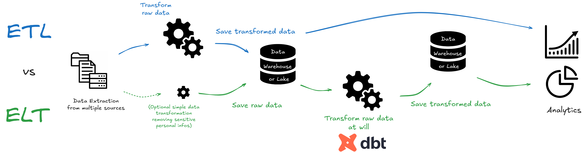
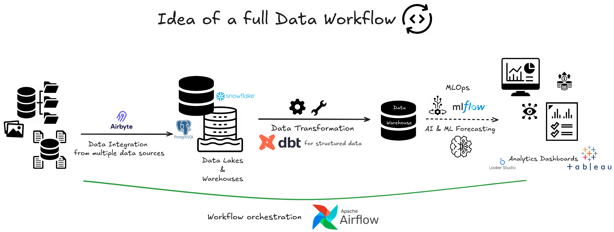

# ELT with DBT : an introductory tutorial 

⭐ This repo contains the code for the **_ELT with DBT : an introductory tutorial_ blogpost** available on Medium : **https://medium.com/@jb.excoffier/elt-with-dbt-an-introductory-tutorial-35780f449d43**. 

It is an introduction to the **_ELT_** (**E**xtract **L**oad **T**ransform) way of processing data and **_DBT_** (**D**ata **B**uild **T**ool) to manage the data transformation part. The blogpost describes the best functionalities of DBT and illustrates each of them with code from this repo.

This repo includes : 
- 💻 DBT codes that includes YAML config files, SQL models and data and unitary tests (`dbt_project` folder and the `profiles.yml` file).
- 💾 Light version of the PAGILA database that is used in the blogpost (`light_pagila_for_dbt_tutorial.sql`).
- 🔧 Setup file for the needed packages (`requirements.txt`).
- 📊 All images that were generated and used in the blogpost (`Images` folder).

 
 
 

  

 
 
 

  

 
 
 

  So, ready to bake some data ?

  

